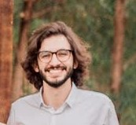

Olá, me chamo **Mateus Toledo da Silveira Leão**. Sou interessado em Engenharia de sofware, Ciência de dados, Otimização, Análise de risco e Tomada de decisão sob Incerteza.

O que esses assuntos têm em _comum_?
Auxiliam a resolução de problemas complexos e reais, tornando-os tangíveis e justificáveis a nós, humanos.

### Minha história ###

Sou graduado em Engenharia Elétrica, pela Pontífica Universidade Católica de Minas Gerais (PUC Minas). Durante minha experiência acadêmica, trabalhei em várias empresas diferentes, e em cada uma tive uma experiência profissional distinta. Portanto, meu objetivo era explorar as possibilidades e caminhos que gostaria de vivenciar. E ao final da graduação, percebi algo:

Gostaria que meu trabalho unisse o **aspecto** abstrato da construção de tecnologia e análise matemática com o **aspecto** relacional e estético, desenvolvendo assim, o potencial criacional do ser humano.

### Estudos ###

Sou mestrando em Ciência da Computação pela PUC Minas, com pesquisa em Tomada de Decisão em Cenários Complexos. Graduado em Engenharia Elétrica pela PUC Minas (2020).

Possuo experiência acadêmica em Tomada de Decisão em Cenários Complexos sob Incerteza; Análise Multicritério; Sistemas fuzzy; Lógica fuzzy; Redes neurais artificiais; Análise Financeira no Mercado Livre de Energia; pesquisador de Lógica e Inteligência Artificial na área de Direito.

Em meus estudos atuais, desenvolvo ciências de dados contemplando todo o ciclo de um projeto, a saber:
* Entendimento do negócio 
* Análise estatística
* Limpeza dos dados
* Feature Engineering
* Análise exploratória de dados
* Preparação dos dados
* Algoritmos de Machine Learning
* Performance dos Algoritmos
* Conversão da performance para resultado financeiro
* Publicação do modelo em produção

Para mais informações sobre meus estudos, sugiro visualizar meus artigos **neste blog** e também minhas [publicações](publications.md) ou consultar meu currículo [lattes](http://lattes.cnpq.br/7074412545424793).

### Profissional ###

Atualmente sou Engenheiro de Software na SYDLE, com experiência em modelar sistemas e automatizar processos, construindo provas de conceito (POCs) para clientes estratégicos.

Também possuo experiencia profissional com desenvolvimento de processos para manufatura de placas de circuito impresso; Engenharia de processos; Melhoria contínua e Cadeia de suprimentos. 

Caso queira visualizar com detalhes estas experiências, você poderá encontrá-lo em meu perfil no [LinkedIn](https://www.linkedin.com/in/mateus-toledo-da-silveira-leao/)

### Um pouco mais sobre mim ###

Quando não estou ocupado meu trabalho e estudos, amo passar meu tempo com minha esposa. Além disso, gosto de cozinhar, ler um bom livro, assistir a um bom filme, e passear em um bosque aqui perto de casa.